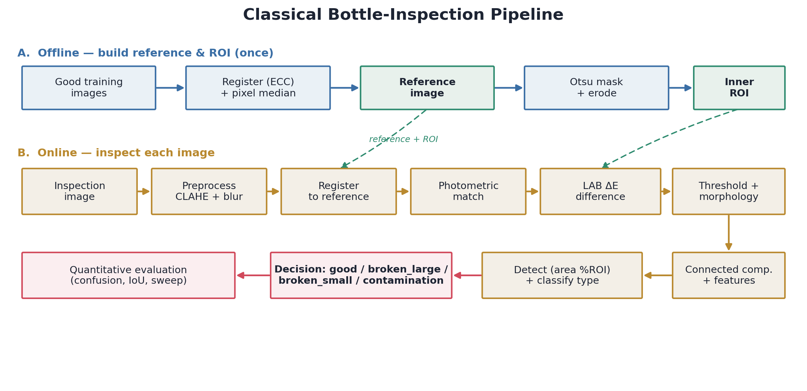
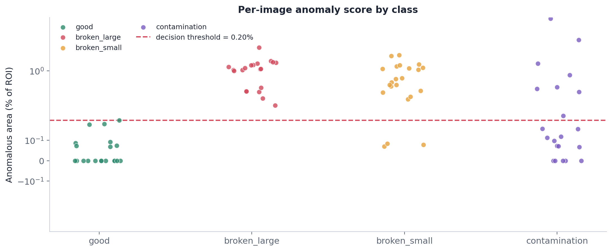
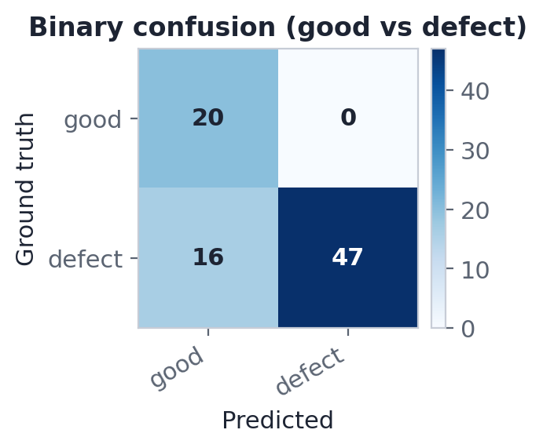
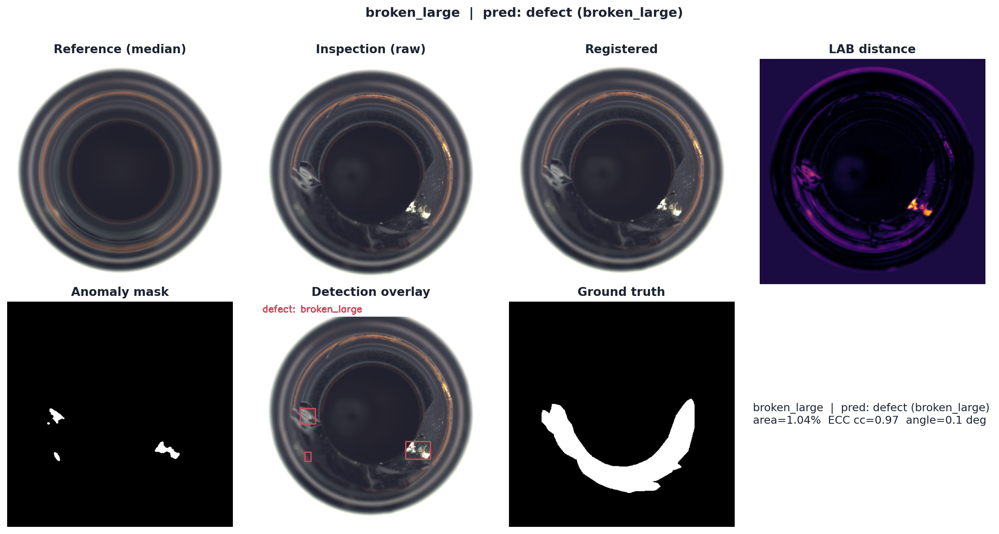

<div align="center">

<h1>🍾 Classical Bottle Defect Inspection</h1>

<p><b>A reference-based computer-vision pipeline that detects and classifies defects on the mouth of glass bottles — using only classical image processing, no machine learning.</b></p>

<p>


</p>



</div>

---

## ✨ Overview

Each bottle is photographed top-down and compared against a **defect-free reference** to decide
whether it is **good** or **defective** — and, if defective, to classify the defect as
**`broken_large`**, **`broken_small`**, or **`contamination`**.

Every stage is classical and interpretable: geometric **registration**, **reference differencing**
in physical colour units, **morphology**, **connected-component** analysis, and an explicit
**rule-based** decision. There is **no learned model and no synthetic data** anywhere in the system.

📄 **Full write-up (IMRaD report):** [Bottle Inspection Report](report/Bottle_Inspection_Report_DIP2026_Lior_Nadav.pdf)

---

## 📊 Results at a glance

<p align="center"><i>Evaluated on the public <b>MVTec AD — bottle</b> set (83 test images).</i></p>

| Metric | Score | Note |
|:--|:--:|:--|
| **Precision** | `1.00` | no false alarms |
| **Recall** | `0.75` | every breakage caught |
| **Specificity** | `1.00` | 0 / 20 good images flagged |
| **F1** | `0.85` | |
| **Accuracy** | `0.81` | |

<p align="center">
<b>Per-type recall</b> &nbsp;·&nbsp; <code>broken_large</code> <b>1.00</b> &nbsp;·&nbsp; <code>broken_small</code> <b>0.86</b> &nbsp;·&nbsp; <code>contamination</code> <b>0.38</b>
</p>

Detection is strong and **raises no false alarms**. The honest limitation is subtle, low-contrast
**contamination** — roughly half of these defects are near-invisible to colour differencing and are
reported transparently as a negative result in the report.

<div align="center">


</div>

---

## 🔬 How it works

```
Offline (built once)
    good images ──ECC align──▶ pixel median ──▶ reference image
    reference   ──Otsu + erode──────────────▶ inner ROI

Online (per inspection image)
    inspection ─▶ preprocess (CLAHE + blur)
               ─▶ register to reference (ECC, Euclidean)
               ─▶ photometric match (gain / bias)
               ─▶ CIELAB ΔE difference
               ─▶ threshold + morphology
               ─▶ connected components + features
               ─▶ detect (area % of ROI) ─▶ classify type ─▶ evaluate
```

**Design choices that matter**

| Choice | Why |
|:--|:--|
| **Registered-median reference** | aligning good samples before the median keeps the amber ring sharp instead of smeared |
| **Photometric gain/bias match** | removes global illumination differences — the single biggest false-positive reducer |
| **CIELAB ΔE in _physical_ units** | the difference map is **not** per-image normalised, so one fixed threshold is comparable everywhere |
| **Balanced-accuracy calibration** | the decision threshold respects the class imbalance instead of over-favouring recall (as F1 would) |

A full processing chain on a real defect:

<div align="center">

</div>

---

## 🚀 Quick start

```bash
pip install -r requirements.txt

# full pipeline: build reference → run all test images → calibrate →
# write results/ and regenerate every figure in article_assets/
python -m src.run_all --data data/bottle --out results --assets article_assets

# (optional) rebuild the PDF report from the latest results
python report/build_report.py
```

<details>
<summary><b>📦 What gets produced</b></summary>

<br>

| Output | Contents |
|:--|:--|
| `results/predictions.csv` | per-image prediction, scores, registration diagnostics |
| `results/metrics.json`, `summary_metrics.csv` | image-level metrics |
| `results/confusion_matrix.csv`, `confusion_multiclass.csv` | confusion matrices |
| `results/pixel_iou.csv` | auxiliary pixel-level localisation vs. ground truth |
| `results/per_image/<class>_<id>/` | diff · mask · roi · registered · overlay PNGs |
| `article_assets/*.png` | all report figures |
| `report/Bottle_Inspection_Report_DIP2026_Lior.pdf` | the report |

</details>

---

## 🗂️ Repository layout

```
src/                     pipeline source (well commented)
├─ config.py               frozen parameters
├─ io_utils.py             image loading / listing
├─ preprocessing.py        CLAHE · reference build · bottle mask + ROI · photometric match
├─ registration.py         ECC (Euclidean) alignment to the reference
├─ differencing.py         CIELAB ΔE difference map
├─ segmentation.py         thresholding · morphology · connected components
├─ features.py             per-component shape / brightness descriptors
├─ classification.py       detect + rule-based defect typing
├─ pipeline.py             per-image orchestration
├─ evaluate.py             metrics · confusion · threshold calibration · pixel IoU
├─ visualization.py        all report figures
└─ run_all.py              end-to-end entry point

tools/make_block_diagram.py   pipeline block diagram
report/                       build_report.py + the PDF
article_assets/               publication-quality figures
results/                      predictions, metrics, confusion matrices, per-image outputs
data/bottle/                  dataset (see below)
```

---

<div align="center">
<sub>All processing at 512×512 · parameters frozen in <code>src/config.py</code> · classical methods only.<br>
The course brief encourages original images; the public MVTec set was used for reproducibility and
ground-truth masks — see the report's <i>Note on data</i>.</sub>
</div>
